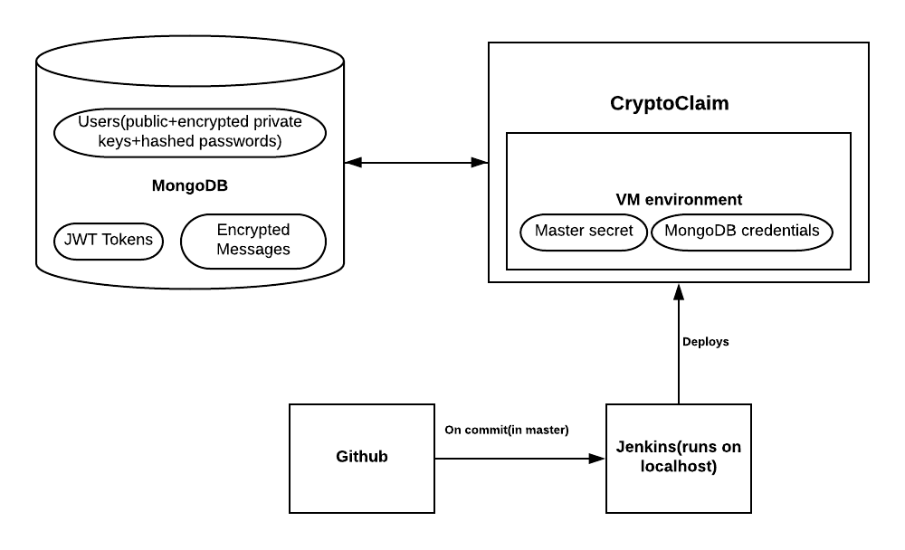

# CryptoClaim architecture

##### First lets present an overview of the whole application and the interactions between the services that are used.

CryptoClaim is an application that runs in the Cloud Foundry Environment (https://docs.cloudfoundry.org/). Some of the main variables are stored in memory in the environment of the VM that is used for running the application.
The master secret (master key) is stored as an environment variable which is very practical in the cloud world. Also the credentials used for authentication to the MongoDB instance are stored in the environment.

### MongoDB usage

All the customer-related data is stored in MongoDB - JWT tokens used for authentication(currently they are implemented as one time tokens), information regarding the users - this includes the client id (you can think of it as an username), password hashed using SHA256 algorithm, public key of the user and encrypted private key(encrypted with the master secret using AES/ECB mode).  

### Private key usage

The private key shall be used in two ways:
- Signing the JWT tokens(the claims)
- Decrypting the messages encrypted with the public key(of certain client/user)

### Public key usage

The public key shall be used in two ways:
- Verification of the signed JWT token
- Encrypting the messages being sent